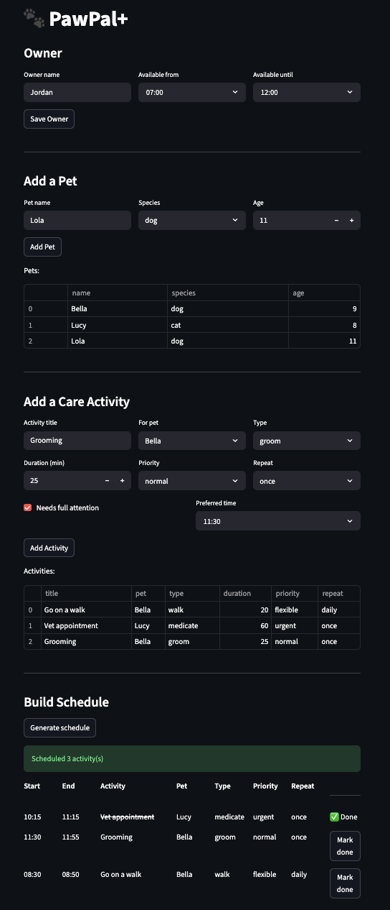

# PawPal+ (Module 2 Project)

PawPal+ is a Streamlit-powered pet care planning assistant that helps busy pet owners organize, prioritize, and schedule daily care tasks across multiple pets.


## 📸 Demo

<a href="_demo.png" target="_blank"></a>

---

## Features

- **Priority-based sorting** — urgent tasks are always placed before normal or flexible ones
- **Preferred time scheduling** — tasks are placed at or after their preferred time; ties go to the earlier time
- **Conflict warnings** — after scheduling, the app flags same-pet overlaps and owner double-bookings
- **Daily & weekly recurrence** — marking a recurring task done creates the next occurrence automatically
- **Mark task complete** — each scheduled entry has a "Mark done" button; completed tasks are struck through in the UI
- **Care window enforcement** — no task is placed outside the owner's available hours
- **Skipped task reporting** — tasks that don't fit the window are listed with a reason, not silently dropped

---

## Smarter Scheduling

The scheduler goes beyond a simple task list- it actively detects and reports conflicts so nothing slips through:

- **Conflict detection during placement** — before slotting an activity, `detect_conflict` checks whether a full-attention task for the same pet already occupies that time window. If there's a clash, the slot is pushed forward automatically.
- **Post-schedule conflict check** — after the full schedule is built, `check_conflicts` scans every pair of entries for overlaps. It distinguishes two kinds:
  - *Same-pet conflicts* — two tasks scheduled at the same time for the same pet.
  - *Owner conflicts* — tasks for different pets that overlap, since the owner can't be in two places at once.
- **Priority-first ordering** — urgent tasks are always placed before normal or flexible ones, so high-priority care (medications, vet visits) secures the best available slot first.
- **Skipped task reporting** — if no slot fits within the owner's care window, the task is recorded in a `skipped` list with a reason, rather than silently dropped.
- **Flexible filtering** — `filter_by_pet` and `filter_by_status` let the UI show a focused view (e.g. only Buddy's tasks, or only tasks still pending).
----
## Getting started

### Setup

```bash
python -m venv .venv
source .venv/bin/activate  # Windows: .venv\Scripts\activate
pip install -r requirements.txt
```
## Run the App
streamlit run app.py

## Run Tests
python -m pytest tests/test_pawpal.py -v

### Testing PawPal+

The test suite covers three main areas:

**Sorting** — makes sure urgent tasks always get scheduled before normal or flexible ones, and that earlier preferred times come first when two tasks have the same priority.

**Recurring tasks** — confirms that marking a daily task done automatically creates the next one for tomorrow (and weekly tasks create one for 7 days later). One-time tasks just mark done and stop there.

**Conflict detection** — checks that two tasks at the exact same time get flagged, that the scheduler pushes the second task forward instead of double-booking, and that back-to-back tasks (one ends at 9:00, next starts at 9:00) are correctly treated as fine, not a conflict.

There are also smaller checks for edge cases like a pet with no tasks, activities that don't fit inside the owner's care window (they go into a "skipped" list), and filter helpers that let you view only one pet's tasks or only pending tasks.

### Confidence Level

**4 / 5 stars**


